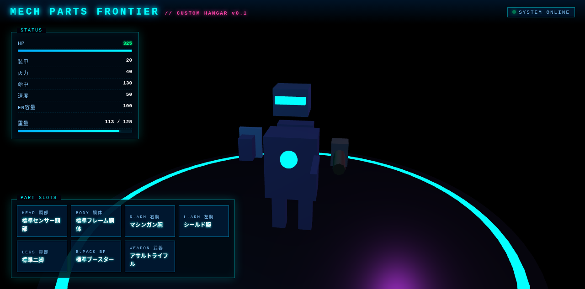

# 🤖 MECH PARTS FRONTIER — Custom Hangar v0.1

 

**メカのパーツを自由に組み替えて、自分だけのオリジナルメカを構築** するカスタムハンガーだよ！

## 🎮 できること

## 📸 スクリーンショット



- 🔧 **パーツ選択** — 頭部・胴体・腕・脚を自由に組み合わせ
- 🎨 **リアルタイムプレビュー** — Canvasでその場描画
- 💾 **カスタム保存** — お気に入りの構成を保存
- 🌌 **サイバーパンクUI** — コックピット風インターフェース

## 📂 ファイル構成

| ファイル | 内容 |
|----------|------|
| `index.html` | メインUI（523行） |
| `mech-builder.js` | メカ構築ロジック |
| `parts-data.js` | パーツ定義データ |
| `debug.html` | デバッグ画面 |

## 🚀 起動方法

```bash
cd MechPartsFrontier
# index.html をブラウザで開くだけ！
```

## 🛠 技術

- HTML5 Canvas 2D
- バニラJavaScript
- クリーンなデータ駆動設計（parts-data.js）

## 🔮 ロードマップ

- [ ] パーツ種類の追加
- [ ] アニメーション
- [ ] エクスポート機能

## 📝 作者

- **ロドリン** & **シンクロ（グラム）** 💎🛸
- rodorin-lab © 2026
